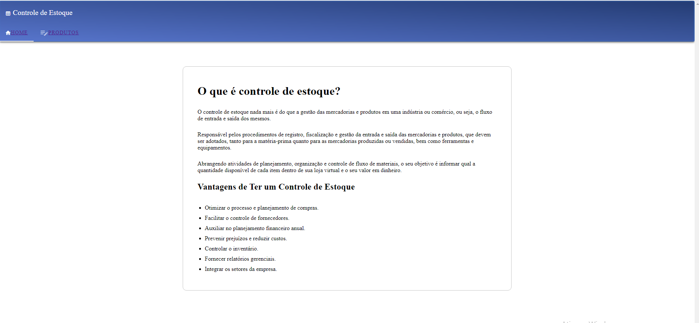
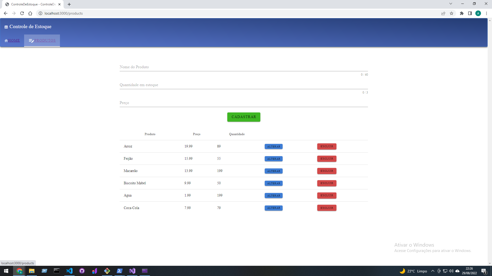

# Controle de Estoque

## Funcionalidades
<ul>
    <li>Cadastrar produtos</li>
    <li>Alterar produtos</li>
    <li>Excluir produtos</li>
</ul>

## Tecnologias Utilizadas

<ul>
    <li>VueJS</li>
    <li>Nuxt.js</li>
    <li>Vuetify</li>
    <li>ASP.NET Core</li>
    <li>Entity Framework</li>
    <li>SQLite</li>
</ul>

## Telas

#### Home

 

#### Tela de Produtos

